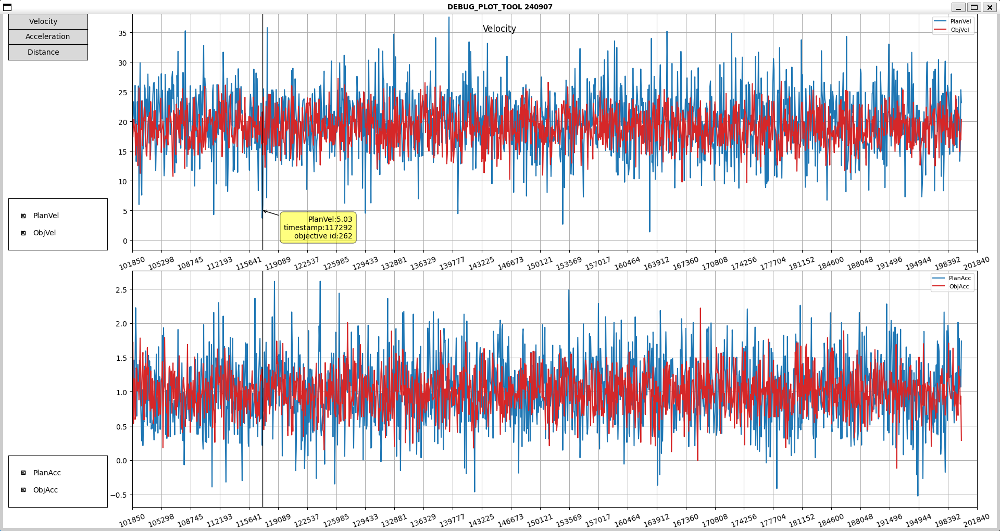
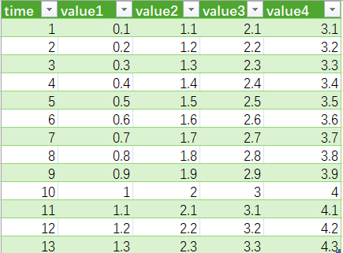

# Excel-plot
在进行自动驾驶/机器人/无人机等对象的调试时, 经常需要保存数据并观察曲线分析位置/速度/加速度等状态量.

excel自带的数据绘图功能交互性有限, 无法做到缩放/拖动/点击显示详细信息等功能.

本项目基于matplotlib开发了一款工具, 能够支持绘制excel/txt保存的数据曲线, 能够进行**多类型数据显示/缩放/拖动/时间同步/鼠标点击显示**等功能.

## 界面操作
界面左侧为交互控件区域, 界面右侧是曲线显示区域, 一张子图上显示同一单位的数据.

* 点击左上角的按键, 能够实现某张子图的显示与隐藏;
* 点击每张子图左侧的复选框, 能够实现该子图中某条曲线的显示与隐藏;
* 左键点击某张子图中数据曲线上的点, 能够显示标签(黄色方框), 显示该点对应时刻的一些状态信息; 左键按住该标签能够实现拖动, 右键点击该标签取消显示;
* 右键按住某张子图中的空白处拖动, 能够拖动显示该子图中曲线显示横向范围和纵向范围, 其它子图同步横向范围的移动;
* 左键点击某张子图的空白处, 能够显示一条竖线, 表示点击位置对应时刻, 其它子图同步显示该时刻表示的竖线;
* 鼠标滚轮在某张子图上滚动, 能够实现该子图横向缩放, 其它子图同步横向缩放行为;
* 鼠标滚轮在某张子图左侧1/5处滚动, 能够实现该子图纵向缩放;

## 数据文件要求
保存的数据文件第一行为表头, 每一列表示一种数据

