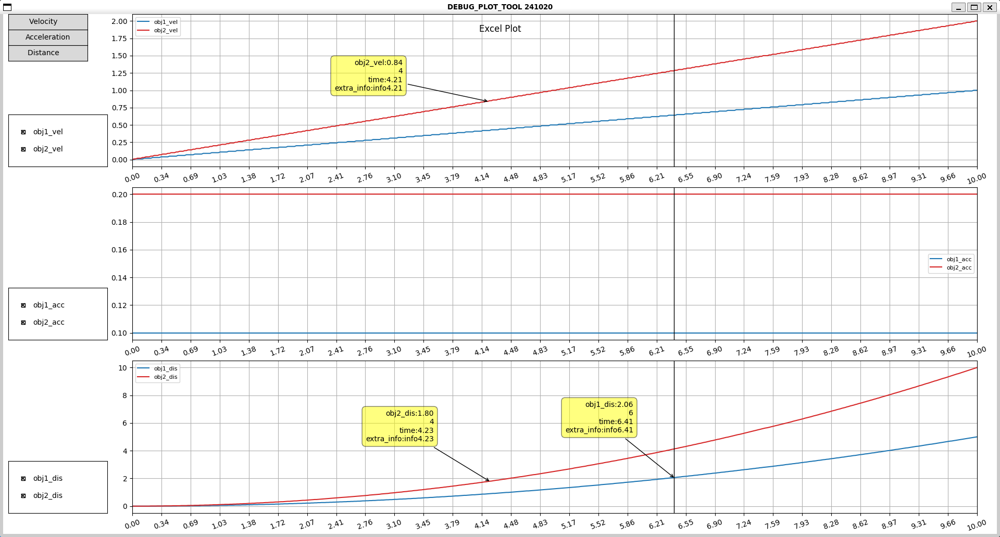
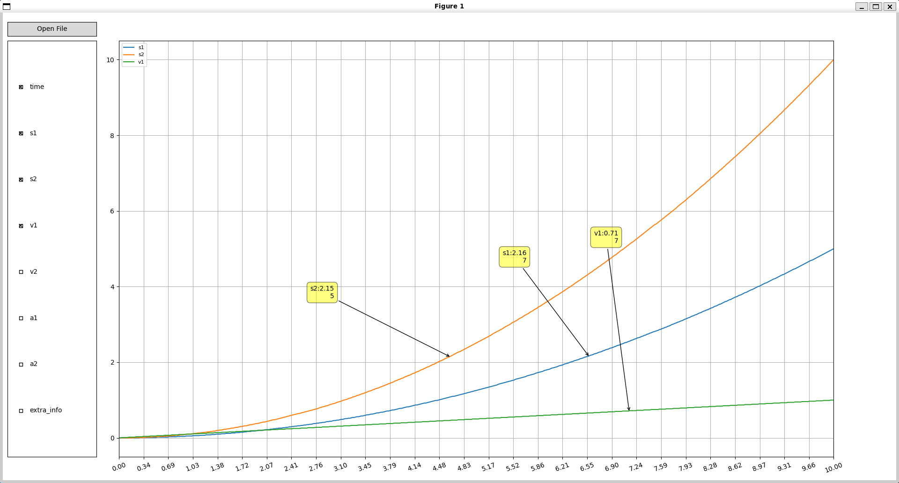
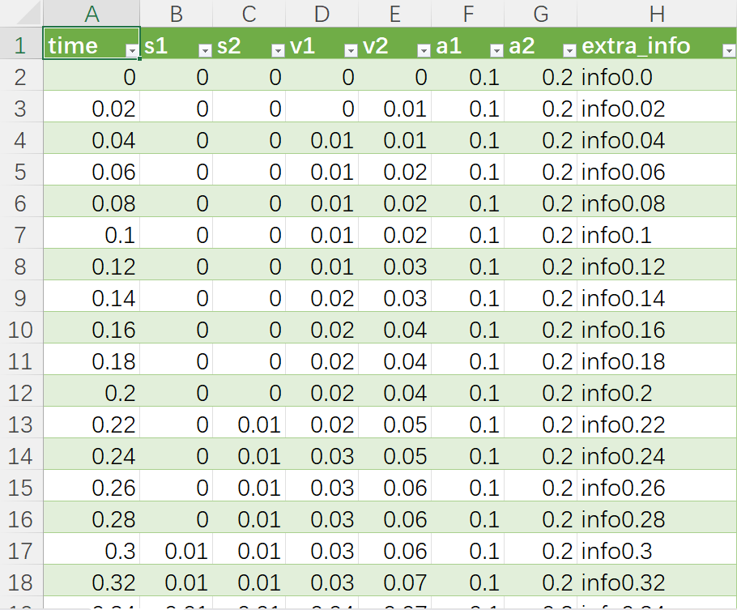

# Excel/txt绘图工具
在进行自动驾驶/机器人/无人机等对象的调试时, 经常需要保存数据并观察曲线分析位置/速度/加速度等状态量.

excel/txt自带的数据绘图功能交互性有限, 无法做到缩放/拖动/点击显示详细信息等功能.

本项目基于matplotlib开发了两款工具, 能够支持绘制excel/txt保存的数据曲线, 能够进行**多类型数据显示/缩放/拖动/时间同步/鼠标点击显示**等功能.

1. 曲线绘图工具1

    读取**固定数据标签**的excel/txt数据, 不需要手动操作绘制, 脚本读取excel/txt一键完成.
    

2. 曲线绘图工具2

    读取**任意数据标签**的excel/txt数据, 不需要在脚本中固定标签名称, 更加灵活.
    

## 界面操作
界面左侧为控件区域, 界面右侧是曲线显示区域.

### 绘图区交互操作
* 左键点击绘图区数据曲线上的点, 显示标签(黄色方框), 显示该点对应时刻的一些状态信息, 左键按住标签拖动, 右键点击标签取消显示;
* 右键按住绘图区空白处拖动, 移动画布, 改变现实范围;
* 左键点击绘图区的空白处, 显示一条竖线, 表示点击位置对应时刻;
* 鼠标滚轮在绘图区右侧4/5处滚动, 横向缩放;
* 鼠标滚轮在绘图区左侧1/5处滚动, 纵向缩放;

### 绘图工具1
* 点击左上角的按键, 显示或隐藏对应的子图;
* 点击子图左侧复选框, 显示或隐藏对应的数据曲线;
* 所有子图同步横向缩放/移动/时间刻度线;

### 绘图工具2
* 点击左上角按键, 打开对话框选择数据文件;
* 点击左侧复选框, 选中的第一个数据为横轴数据, 其余选中的数据都为纵轴数据.

## demo
1. 安装依赖

    ```
    pip install -r requirements.txt
    ```

2. 调用脚本

    具体见[excel_plot_ui.py](example/excel_plot_ui.py)和[excel_plot_ui_mini.py](example/excel_plot_ui_mini.py)两个脚本文件.

## 数据文件要求
保存的数据文件第一行为表头, 每一列表示一种数据
具体见[example_data.xlsx](docs/example_data.xlsx)和[example_data.txt](docs/example_data.txt)两个数据文件
